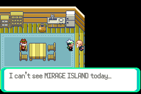
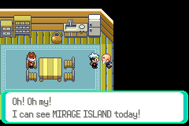
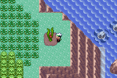

# Pokemon Mod Suite

This suite provides tools for inspecting, modifying, and analysing data
files used in Pokémon games or related ROM-based assets. It includes
interactive SDL-based utilities, checksum helpers, and Python scripts
that automate data extraction, transformation, and patch generation.

------------------------------------------------------------------------

## Installation

### Build (for UNIX)

``` sh
make
```

Both tools require `SDL3` and `SDL3_ttf` to be installed on your system in order to compile (edit Makefile as necessary).

### Install

Install the binaries to `/usr/local/bin`:

``` sh
sudo make install
```

Install to a custom prefix:

``` sh
make install PREFIX=/opt/mytools
```

Install into a packaging root:

``` sh
make install DESTDIR=/tmp/pkgroot
```

### Uninstall

``` sh
sudo make uninstall
```

------------------------------------------------------------------------

## Usage

### Hex Editor

Launch the hex editor:

``` sh
hex_editor <file>
```

### Checksum Calculator

Compute checksum for a file:

``` sh
checksum <file> <game>
```

### Mirage Island Modifier

Edit Mirage Island bytes:

``` sh
mirageisland <file> <game>
```

You can use the `-h` flag with the programs to bring up an extensive usage message.

## How to use the Mirage Island modifier

Mirage Island is an elusive place that is governed by two bytes of memory in RAM (.sav file) that are generated fresh every day.
If the bytes do not match up (likely), you will see this when you go to the man in Pacifidlog Town:

<p align="center">
  
</p>

First, you MUST save your game for today BEFORE using the program. The program relies on a newly generated Mirage Island seed.
By default, the program will save a new file with the suffix `_mirage`. You will then need to make sure this save file has the same name as your ROM. The `-o` flag will overwrite the current save file you have.

After running the program with a fresh save for the day, you should see this when you go to Pacifidlog Town:

<p align="center">
  
</p>

Enjoy the island!

<p align="center">
  
</p>


------------------------------------------------------------------------

## Python Scripts

Two Python utilities are included in the `src/scripts/` directory. These
scripts translate between byte arrays and specific game encodings if you 
just need some text converted quickly.

These scripts will be added to soon.
