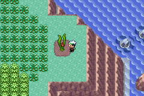

# Pokemon Mod Suite

This suite provides tools for inspecting, modifying, and analysing data
files used in Pokémon games or related ROM/RAM-based assets. It includes
interactive SDL-based utilities, checksum helpers, and Python scripts
that automate data extraction, transformation, and patch generation.

The tools can be built either as six separate command-line programs or as
a single graphical application that puts every tool behind one window.

------------------------------------------------------------------------

## Installation

### Prerequisites

All tools require `SDL3` and `SDL3_ttf` to compile.

On macOS (Homebrew):

```sh
brew install sdl3 sdl3_ttf
```

On Linux, install `SDL3` and `SDL3_ttf` from your distribution's package
manager (or build them from source) and edit the `Makefile` if your
include/library paths differ.

### Build modes

There are three ways to build the suite:

```sh
make          # six individual command-line programs
make single   # one combined graphical application (pokemon_tools)
make app      # macOS: wrap the combined app in a double-clickable .app
```

`make` and `make single` are independent; building one does not affect the
other.

### Build (for UNIX)

```sh
make
```

This produces the six individual binaries: `hex_editor`, `checksum`,
`pokemon_bag`, `pokemon_party`, `mirageisland`, and `pokemon_trainer`.

### Unified Graphical Application

```sh
make single
```

This builds a single `pokemon_tools` executable. Launching it opens an SDL
window from which you can run any of the tools without using the command
line:

- **Tool selector** - choose Hex Editor, Checksum, Pokemon Bag, Pokemon
  Party, Mirage Island, or Pokemon Trainer.
- **File field** - type a path directly, or click the **Browse** button to
  the right of the field to pick a file with the native file dialog.
- **Game selector** - pick the game (for tools that need one).
- **Options** - toggle the same flags available on the command line
  (`-j`, `-w`, `-o`, `-p`, byte grouping, text encoding) using checkboxes
  and buttons.
- **Launch** - opens the selected tool. Closing that tool returns you to
  the launcher so you can run another.

Every tool behaves exactly as its standalone command-line counterpart;
this is just a unified point of entry.

### macOS Application Bundle

On macOS you can wrap the unified executable in a double-clickable `.app`:

```sh
make app
```

This builds `pokemon_tools`, then creates `PokemonTools.app` containing:

- the executable in `Contents/MacOS`,
- the bundled `libSDL3` and `libSDL3_ttf` libraries in
  `Contents/Frameworks` (so the app runs on machines that do not have SDL3
  installed),
- an icon generated from `icon.png` in the project root, if that file is
  present (otherwise the system default icon is used).

If you run `make app` on a non-macOS system, the `pokemon_tools` executable
is still built but no `.app` bundle is produced.

#### macOS runtime dependencies

The app bundles the SDL3 libraries, but `SDL3_ttf` depends on a couple of
text-rendering libraries that are **not** bundled. If the app fails to
launch because of them, a Terminal window will open with instructions to
install them via Homebrew:

```sh
brew install harfbuzz freetype
```

After installing them, relaunch the app.

### Install

Install the individual binaries to `/usr/local/bin`:

```sh
sudo make install
```

Install the unified binary instead:

```sh
sudo make install-single
```

Install to a custom prefix:

```sh
make install PREFIX=/opt/mytools
```

Install into a packaging root:

```sh
make install DESTDIR=/tmp/pkgroot
```

### Uninstall

```sh
sudo make uninstall
```

------------------------------------------------------------------------

## Usage

### Hex Editor

Launch the hex editor:

```sh
hex_editor <file>
```

### Checksum Calculator

Compute checksum for a file:

```sh
checksum <file> <game>
```

### Bag Editor

Edit the bag in a save file:

```sh
pokemon_bag <file> <game>
```

### Party Editor

Edit the party in a save file:

```sh
pokemon_party <file> <game>
```

### Mirage Island Modifier

Edit Mirage Island bytes:

```sh
mirageisland <file> <game>
```

### Trainer Editor

Edit trainer data in a ROM:

```sh
pokemon_trainer <romfile> <game>
```

You can use the `-h` flag with the programs to bring up an extensive usage message.

If you built the unified application instead, run `pokemon_tools` (or open
`PokemonTools.app`) and select the tool, file, game, and options in the
window.

## How to use the Mirage Island modifier

Mirage Island is an elusive place that is governed by two bytes of memory in RAM (.sav file) that are generated fresh every day.
If the bytes do not match up (likely), you will see this when you go to the man in Pacifidlog Town:

<p align="center">
  
</p>

First, you MUST save your game for today BEFORE using the program. The program relies on a newly generated Mirage Island seed.
By default, the program will save a new file with the suffix `_mirage`. You will then need to make sure this save file has the same name as your ROM. The `-o` flag will overwrite the current save file you have.

After running the program with a fresh save for the day, you should see this when you go to Pacifidlog Town:

<p align="center">
  
</p>

Enjoy the island!

<p align="center">
  
</p>


------------------------------------------------------------------------

## Python Scripts

Two Python utilities are included in the `src/scripts/` directory. These
scripts translate between byte arrays and specific game encodings for
Pokémon text data. They can be used via command line or through an
interactive GUI.

### Text Encoder/Decoder for Game Boy (Gen 1/2)

`text_to_bytes_gb.py` - Handles text encoding for Pokémon Red, Blue,
Yellow, Gold, Silver, and Crystal.

### Text Encoder/Decoder for GBA (Gen 3)

`text_to_bytes_gba.py` - Handles text encoding for Pokémon Ruby,
Sapphire, FireRed, LeafGreen, and Emerald.

------------------------------------------------------------------------

### GUI Mode

Both scripts launch a graphical interface by default when run without
arguments:

```sh
python text_to_bytes_gb.py
python text_to_bytes_gba.py
```

The GUI provides:

- **Region Selection**: Choose between English/Western or Japanese
  character sets
- **Game Selection**: Pick the specific game for accurate encoding
  tables
- **Text Field**: Enter human-readable text to encode
- **Bytes Field**: Enter hex bytes to decode (with or without spaces)
- **Encode Button**: Convert text → bytes
- **Decode Button**: Convert bytes → text
- **Load File Button**: Import text from a `.txt` file (newlines are
  automatically converted to the appropriate control code placeholder)
- **No Spaces Checkbox**: Output bytes without separating spaces

**Note**: The GUI requires PyQt6. If not installed, the script will
display an error message and print the CLI usage information.

```sh
pip install PyQt6
```

------------------------------------------------------------------------

### CLI Mode

Pass any argument to use command-line mode instead of the GUI.

#### Gen 1/2 (Game Boy)

Encode text to bytes:

```sh
python text_to_bytes_gb.py "Hello"
# Output: 87 A4 AB AB AC

python text_to_bytes_gb.py --gen 2 "Hello"
# Output: 87 A4 AB AB AC
```

Decode bytes to text:

```sh
python text_to_bytes_gb.py -r "87 A4 AB AB AC"
# Output: Hello
```

Use Japanese encoding:

```sh
python text_to_bytes_gb.py -j "Pokemon"
```

Encode from a file (newlines become `<0x55>` control codes):

```sh
python text_to_bytes_gb.py -f input.txt
```

Output without spaces between bytes:

```sh
python text_to_bytes_gb.py -n "Hello"
# Output: 87A4ABABAC
```

#### Gen 3 (GBA)

Encode text to bytes:

```sh
python text_to_bytes_gba.py "Hello"
# Output: C2 D9 E0 E0 E3

python text_to_bytes_gba.py --ruby "Hello"
python text_to_bytes_gba.py --sapphire "Hello"
python text_to_bytes_gba.py --fr "Hello"
python text_to_bytes_gba.py --lg "Hello"
python text_to_bytes_gba.py --emerald "Hello"
```

Decode bytes to text:

```sh
python text_to_bytes_gba.py -r "C2 D9 E0 E0 E3"
# Output: Hello
```

Use Japanese encoding:

```sh
python text_to_bytes_gba.py -j --emerald "Pokemon"
```

Encode from a file (newlines become `<0xFE>` control codes):

```sh
python text_to_bytes_gba.py -f input.txt
```

Output without spaces between bytes:

```sh
python text_to_bytes_gba.py -n "Hello"
# Output: C2D9E0E0E3
```